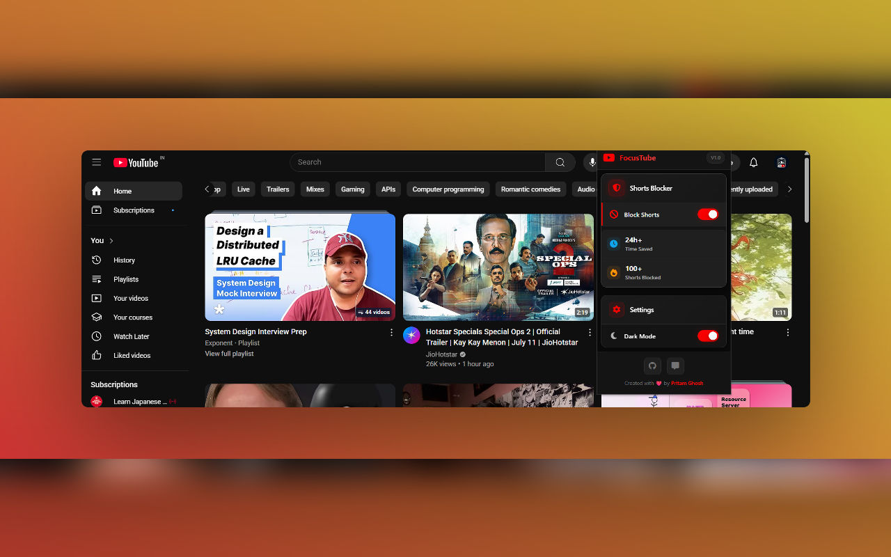

# FocusTube - YouTube Shorts Blocker

A lightweight browser extension that helps you stay focused by blocking YouTube Shorts from your feed, search results, and recommendations.

## Features

- Blocks all YouTube Shorts content
- Simple on/off toggle
- Works instantly (sometimes need to refresh)
- Lightweight and privacy-focused
- Dark mode toggle

## Installation

1. Clone this repository
2. Open Chrome and go to `chrome://extensions/`
3. Enable "Developer mode" (toggle in top-right corner)
4. Click "Load unpacked" and select the extension directory

## Usage

1. Click the extension icon in your toolbar
2. Toggle the switch to enable/disable Shorts blocking
3. Refresh any open YouTube tabs for changes to take effect

## Contributing

Contributions are welcome! Please read our [Contributing Guidelines](https://github.com/PrtHub/focus-tube/blob/main/CONTRIBUTING.md) for details.

## License

This project is licensed under the MIT License - see the [LICENSE](LICENSE) file for details.

## Support

If you find this extension useful, please consider giving it a ⭐️ on GitHub!
